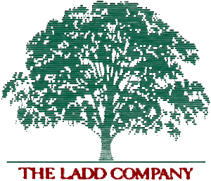

# Hobbies

## &#10132; Cinema

+ [Usr. profile on MUBI: 1,196 Ratings & Reviews, so far.](https://mubi.com/es/users/272774 "Online movie streaming service")

**My favorite movies:**

    + Les Quatro Cents Coupes.  François Truffaut (1959).

    + Blade Runner. Ridley Scott (1982).

| En décembre 1999, MK2 Productions absorbe *Les Films du Carrosse*. |  The Ladd Company released Blade Runner in 1982.|    
| ----------- | ----------- |
|<figure markdown="span">   <figcaption> Marin Karmitz</figcaption></figure> | <figure markdown="span"> <figcaption> </figcaption> Founded in October of 1979 by a team of former Fox executives</figure>   |
    

+ [300 movies that Rober Ebert -website- consider worthy of beign called "great"  ](https://www.rogerebert.com/great-movies "RoberEbert.com").

* [*Roger Ebert*](https://en.wikipedia.org/wiki/Roger_Ebert "Wikipedia entry") *was a film critic for the Chicago Sun-Times from 1967 until his death in 2013.* 


--- 

## &#10132; Music


+ [My Playlist on Spotify](https://open.spotify.com/user/leobardo_oscar "1,504 Public Playlists")

--- 

## &#10132; Dogs


--- 


## &#10132; Photography

```{admonition} Work in progress!
Currently working on image galleries. 
```
In the meantime you can have a look on my[ Clouds image gallery. ](https://leobardooscar.github.io/clouds/ "Clouds spotted in Guadalajara Jalisco, Mexico") 

or my [ Flicker image showcase](https://www.flickr.com/people/loao/ "Flickr") 


--- 


## &#10132; Lexicography

#### English Spanish Dictionary

+ Description:

This is not intended to be a professional dictionary by any means.
This is just a collection of English vocabulary used in news, debates and opinion shows. 
The goal is to learn the intricacies of building an online dictionary.
I'm just an enthuisiast of lexicography.
Work in progress :-)

+ Link:
[[&#10075;  Lexonomy English - Spanish Dictionary &#10076;](https://www.lexonomy.eu/#english_spanish "Home page")] 

+ Tools I recommend: 

    + [Skell - Sketch Engine for language learning](https://skell.sketchengine.eu "Corpus")

    + [Word Hippo](https://www.wordhippo.com/ "Synonyms, ")

--- 

## &#10132; Nephologist 

+ Cloud observation & appreciation


