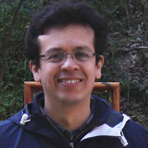

# Basic Information



 
<!-- Add warning 
 
 ```{warning} 
 
This projec is under heavy development
 
 ``` 
-->

<!-- Read it as if it were RST and Add Toc tree 
If you want to render Toctree in index.md
otherwise create a file where to add the directive


 ```{eval-rst} 
 

 .. toctree::
   :maxdepth: 2
   :caption: Contents:


   about.rst
   further_education.rst

 
 ``` 
-->

### **Name**
Leobardo Oscar Alcántara Ocaña

I was born on July 6th, 1972 in México City, CDMX (former D.F.). 

###  **Contact**
**leobardooscar@gmail.com**
<br />
**leobardo@iteso.mx**

<br />

---

### &#10132; **Academic degrees**
+ **1996**	B.A. in Communication Sciences - ITESO University, Guadalajara México.
+ **2012**	M.A. in Communication of Science & Culture - ITESO University, Guadalajara México.

---

### &#10132; **Work experience**
+ **1999 – 2020** Web Designer & Web Content Manager. “Dr. Jorge Villalobos Padilla” Library. ITESO University. 97 – 2003 University's Web Portal Content Manager. ITESO University. 
+ **99 – 2001; 2011** Reference librarian. ITESO University.
+ **2007 – 2008** Reference librarian. "Cultural Centre Library". Supreme Court of Justice of the Nation (SCJN), Mexico.

---

### &#10132; **Skills & Capabilities**

####  Technical &#10002;
+ Web content administration with Drupal & WordPress.
+ Documentation of projects and procedures.
+ GUI customization (theming) of Repositories, Catalogs & Integrated Library Systems like Aleph, DSpace & Vufind.
+ Work comfortably with Windows, Mac, or Linux.

#### Communication &#10002;
+ Facilitate effective and meaningful communication, by mediating the request and response process between developers, staff, and end users of online information systems.


<!-- For full documentation visit [mkdocs.org](https://www.mkdocs.org).-->

