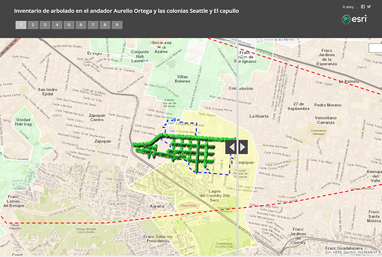
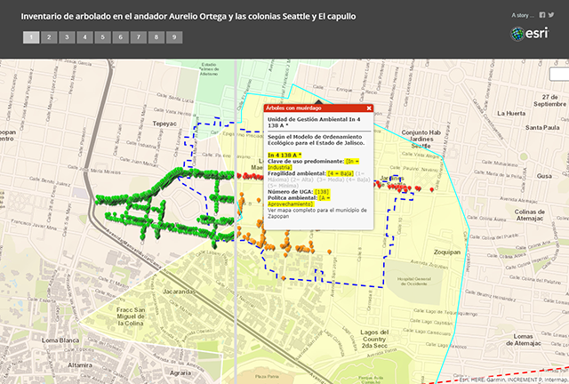
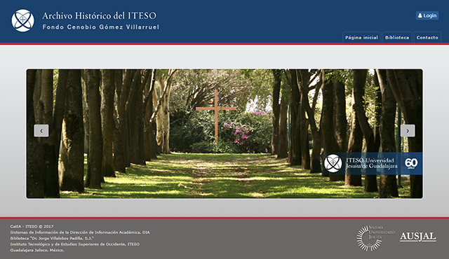
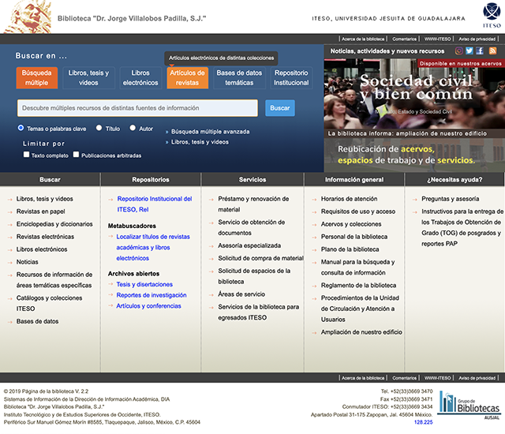
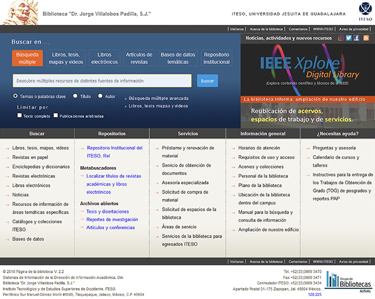
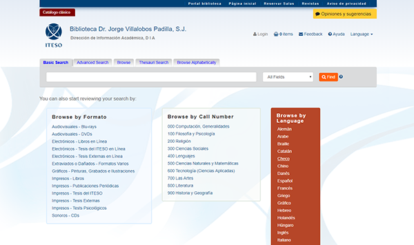
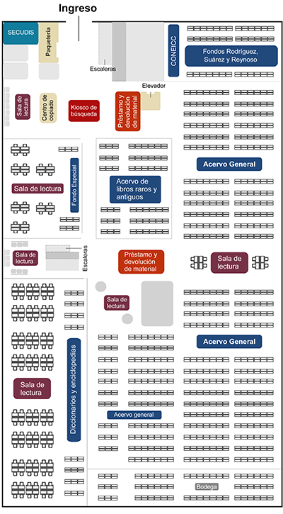
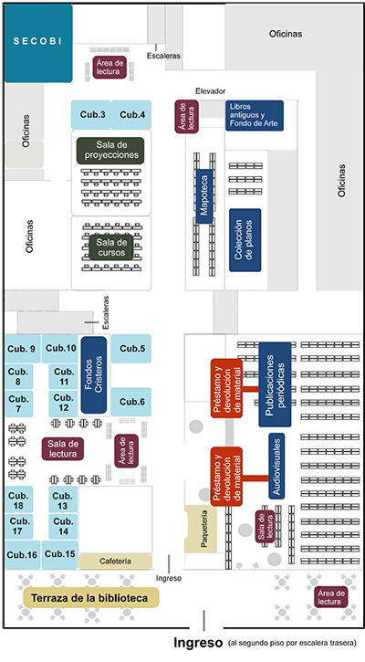

# Web Projects Gallery
## &#10132; Geomatics
+ Mistletoe-infested trees. Inventory within an urban polygon.
+ ESRI ArcGIS & ArcGIS StoryMaps.

| Guadalajara City Metropolitan Area     Each color represents an Administrative area. | Zapopan Downtown    View of Study Area: Inventory of 2,500 trees.|
| ----------- | ----------- |
|     [&#8594; Available at ArcGIS StoryMaps](https://www.arcgis.com/apps/StorytellingSwipe/index.html?appid=e02b45f5efb74b10a24bc7ad9f962b7f " ESRI ArcGis Story Maps").    |    [&#8594; Available at ArcGIS StoryMaps](https://www.arcgis.com/apps/StorytellingSwipe/index.html?appid=e02b45f5efb74b10a24bc7ad9f962b7f " ESRI ArcGis Story Maps").   |
| **Urban Heritage Protection Area**    Represented by the blue dotted line.   | **Study Area Zoom In**    Red trees are Mistletoe-infested.|
|  [&#8594; Available at ArcGIS StoryMaps](https://www.arcgis.com/apps/StorytellingSwipe/index.html?appid=e02b45f5efb74b10a24bc7ad9f962b7f " ESRI ArcGis Story Maps"). |     [&#8594; Available at ArcGIS StoryMaps](https://www.arcgis.com/apps/StorytellingSwipe/index.html?appid=e02b45f5efb74b10a24bc7ad9f962b7f " ESRI ArcGis Story Maps").     |

---

## &#10132; GUI & UX design

### University Historical Photograph Collection
+ Open Access Initiative, OAI.

| ITESO University Academic Repository      | Universities Entrusted to the Society of Jesus In Latin America Repository |
| ----------- | ----------- |
|       |       |
| [&#8594; More images on Adobe Portfolio [here]](https://leobardooscar.myportfolio.com/university-historic-photograph-collection "Behance portfolio ").   | [&#8594; More images on Adobe Portfolio [here]](https://leobardooscar.myportfolio.com/university-historic-photograph-collection "Behance portfolio ").        |

### Library Web portal
+ ITESO University Library Web portal
+ Drupal

| Front A      | Front B |
| ----------- | ----------- |
|       |       |
| [&#8594; CV Boostrap version & Project Gallery [here] ](https://leobardooscar.github.io/portfolio/gui_ux.html "GUI & UX design works").   | [&#8594; CV Boostrap version & Project Gallery [here] ](https://leobardooscar.github.io/portfolio/gui_ux.html "GUI & UX design works").        |

---

## &#10132; GUI Customization
### Discovery Search
+ Online Public Access Catalog Discovery Search
+ Vufind 

| Home      | Browse |
| ----------- | ----------- |
|       |       |
| [&#8594; Available online [here]](https://opac.biblio.iteso.mx/vufind/ "Front page").   | [&#8594; Available online [here] ](https://opac.biblio.iteso.mx/vufind/browse/ "Browse").        |

### Academic repositories 
+ DSpace repositories branding

| Home      | Browse |
| ----------- | ----------- |
|       |       |
| [More images on Adobe Portfolio [here]](https://leobardooscar.myportfolio.com/academic-institutional-repository-v2 "Behance portfolio ").   | [More images on Adobe Portfolio [here]](https://leobardooscar.myportfolio.com/repository-of-the-association-of-universities-entrusted "GUI & UX design works").        |

### Thesauri
+ Online Library's Thesauri 

| Home      | Browse |
| ----------- | ----------- |
|       |       |
| [Boostrap version CV & Project Gallery [here]](https://leobardooscar.github.io/portfolio/gui_ux.html "Behance portfolio ").   | [Boostrap version CV & Project Gallery [here]](https://leobardooscar.github.io/portfolio/gui_ux.html "GUI & UX design works").        |

## &#10132; SVG GUI design.

+ Library building floors.  
+ Scalable Vector Graphics (SVG) Interactive Map. ITESO University.

| Floor one     | Floor two |
| ----------- | ----------- |
|       |       |
| [SVG online version [here]](https://leobardooscar.github.io/portfolio/svg.html "SVG").   | [SVG online version [here]](https://leobardooscar.github.io/portfolio/svg.html "SVG").        |

---

[More images on Behance Portfolio [here]](https://leobardooscar.myportfolio.com/ " ").

[Boostrap version CV & Project Gallery [here] ](https://leobardooscar.github.io/portfolio/geomatics.html "Geomatics").

